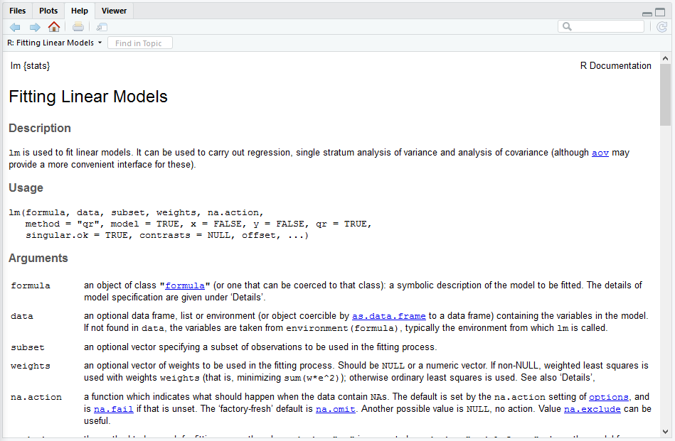

```{r setup, include=FALSE}
options(htmltools.dir.version = FALSE)
```

# Why use R

- Reproducible

--

- Transformable

--

- Easier than you think

---
# About me

- Alex Axthelm
- Data Analyst at Indiana Commsission for Higher Education
- Masters Student in Data Science at IUB
- Works with `R` regularly  (~5 years experience)

---
layout: true

# .grey[Setup: ]
---
class: inverse
.center[.Large[Before we get started, Let's get ready.]]
---
Opening RStudio

- RStudio Layout
- Navigating Multi-panes
- Source vs. Console

---
Suggested Practices

I have strong opinons about best practices, based on experience.

You are free to ignore the settings I suggest here, but all of these are designed to make your life easier.

As we go along, there will also be suggested practices such as:

.full-width[.content-box-purple[Use indentation to show logical progression]]

---
RStudio Settings 

### General 

.content-box-green[From the menu bar: `Tools` -> `Global Options`]

- **UNCHECK** Re-use idle sessions for project links
- **UNCHECK** Restore .RData into workspace at startup
  -- Save workspace to .RData on exit: **SET TO NEVER**

.content-box-purple[This prevents you from loading old work that you don't remember]

---

.content-box-green[RStudio Settings -> Code]

- **UNCHECK** Soft-wrap R source files

### Code -> Display

- **CHECK** Show margin

.content-box-purple[Make lines 80 characters wide so you don't need to scroll to the side]

- **CHECK** Show indent guides

.content-box-purple[Use indentation to show logical progression]
---
 `Lint`ing

> A linter or lint refers to tools that analyze source code to flag programming errors, bugs, stylistic errors, and suspicious constructs.
> 
> --https://en.wikipedia.org/wiki/Lint_(software)

We will use a package called `lintr` to help warn us of errors, and encourage good habits while coding.

To Enable `lintr`:

.content-box-purple[`Tools` -> `Global Options` -> `Code` -> `Diagnostics`]

---
Our goal today

- Start with some "raw" data
  - (in Excel, no less)
- Transform it to extract useful information
- Make some nice plots
- Wrap everything into a human-readable report
- Keep our sanity throughout
---
Projects

- Start a new RStudio Project
  - New Directory
  - in console: `RWorkshopINAIR2018::copy_cr_data()`
    - This should copy an excel file to your directory

.content-box-purple[
Start all new work in its own project directory, to prevent work from one project affecting another.
]

---
layout: true
# .grey[R basics: ]
---
class: inverse
.center[.Large[Let's explore some of the fundamental ideas that we will use in `R`.]]
---
Assigning Objects

`R` is an untyped language, with no initialization required.

```{r}
x <- 10
y <- 20
x + y
```
--
```{r}
z <- x + y
```
--
```{r}
z

```
--
```{r}
print(z)
```
---
Object Types

`R` objects can be assigned objects of different types

```{r}
x <- 10L # integer
print(c(x, class(x)))
```
--
```{r}
y <- 9.75 # numeric (floating-point)
print(c(y, class(y)))
```
--
```{r}
z <- "ten" # string
print(c(z, class(z)))
```
---
objects can interact

```{r}
print(c(x, y, z)) # still using same values
```
--
```{r, error = TRUE}
a <- x + y # Can add int and float
print(c(a, class(a)))
```
--
```{r, error = TRUE}
b <- x + z # cannot add numeric and character
```
---
Functions

The basic syntax for using functions is
```r
value <- function(argument1, argument2, ...)
```
```{r}
union(x, y)
sqrt(100 + 21)
union(y, sqrt(100 + 21))
```
---
Named Arguments

Arguments are matched by name, then fall back on position

```{r, error = TRUE}
a <- lm(formula = wt ~ qsec, data = mtcars)
b <- lm(data = mtcars, formula = wt ~ qsec) # args reversed
c <- lm(wt ~ qsec, mtcars) # in default order
identical(a, b)
identical(b, c)
```
--
```{r, error = TRUE}
lm(mtcars, wt ~ qsec) # match by position, reversed
```
---
Help!

to find information on a function, you can use `?<function>`

```r
?lm
```

```{r, echo = FALSE}

```

---
Putting things together

We can assemble objects into vectors using the `c() and list()` functions

```{r}
c(2, 5, 22.76)
```
--
```{r}
c(4, 5L, TRUE)
```
--
```{r}
c("word", 1.3, 2L, FALSE)
```
.full-width[.content-box-purple[character > numeric > integer > logical]]

---
Vectors vs Lists
--
```{r}
c("word", 1.3, 2L, FALSE)
```
--
```{r}
list("word", 1.3, 2L, FALSE)
```


---
Sequences

Create sequences using `seq()` or `:`

```{r}
1:12
seq(1, 12)
seq(from = 1, to = 12)
seq(from = 1, to = 12, by = 3)
```

---
layout: true

# .grey[Importing: ]
---
class: inverse
.center[.Large[Now we're really on our way.]]

---
Our data set

Source Data for ICHE's "College Readiness Report" ([http://in.gov/che/2489.htm](http://in.gov/che/2489.htm))

.content-box-green[Take a few minutes to explore the Excel file]
---
Starting a script

We will start a new a analysis script, and load the tidyverse

---
`tidyverse`

```{r, cache = FALSE}
library("tidyverse")
```

Tidyverse contains a lot of useful functions that make working in R a lot easier.

.content-box-purple[Most of my scripts start with `library("tidyverse")`]

---
`read_xlsx`

The workhorse for our importing is going to be `read_xlsx()`, from the `readxl` package

```{r, cache = FALSE}
library("readxl")
```

```r
read_xlsx(path, sheet = NULL, range = NULL, col_names = TRUE,
  col_types = NULL, na = "", trim_ws = TRUE, skip = 0, n_max = Inf,
  guess_max = min(1000, n_max))
```
